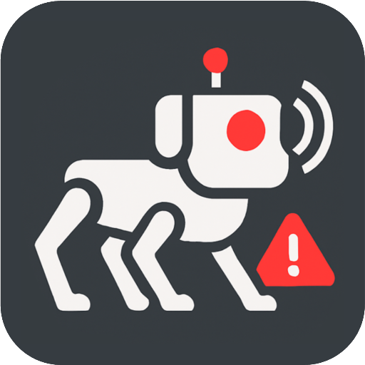
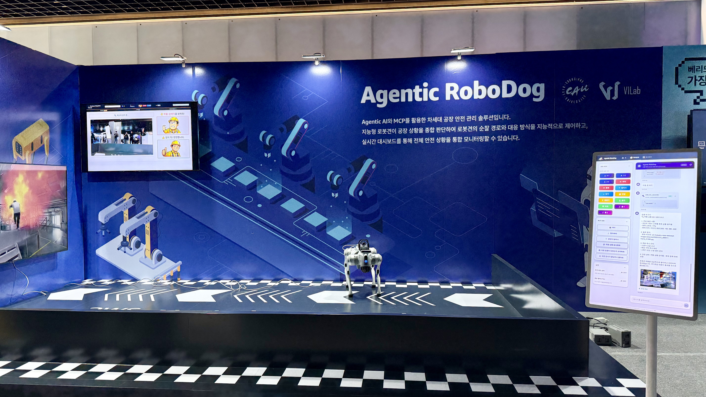
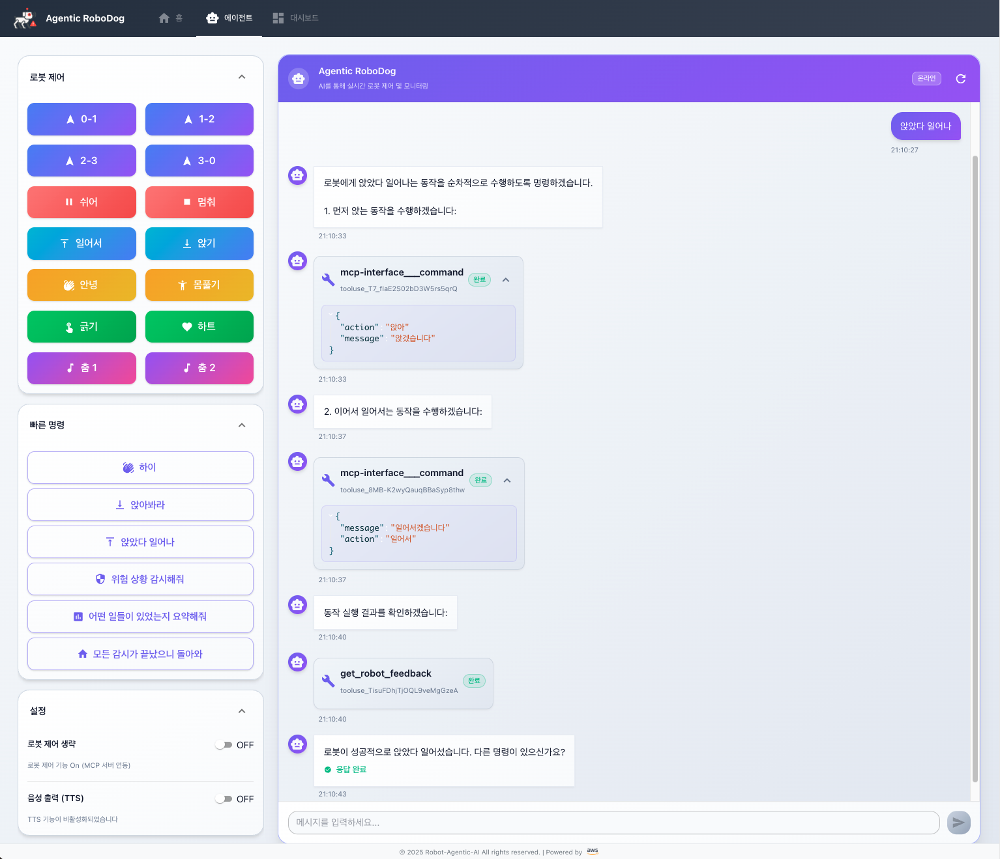
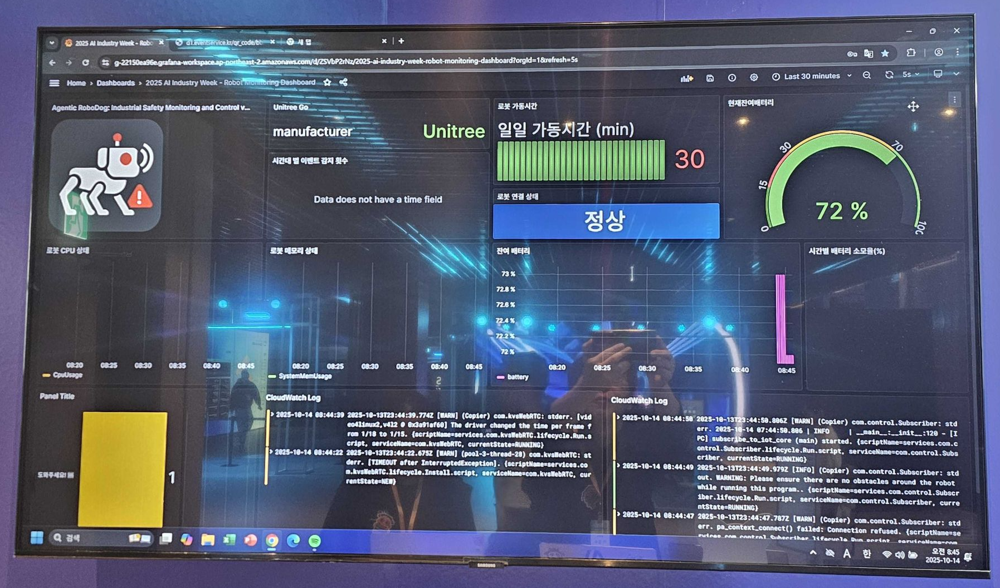
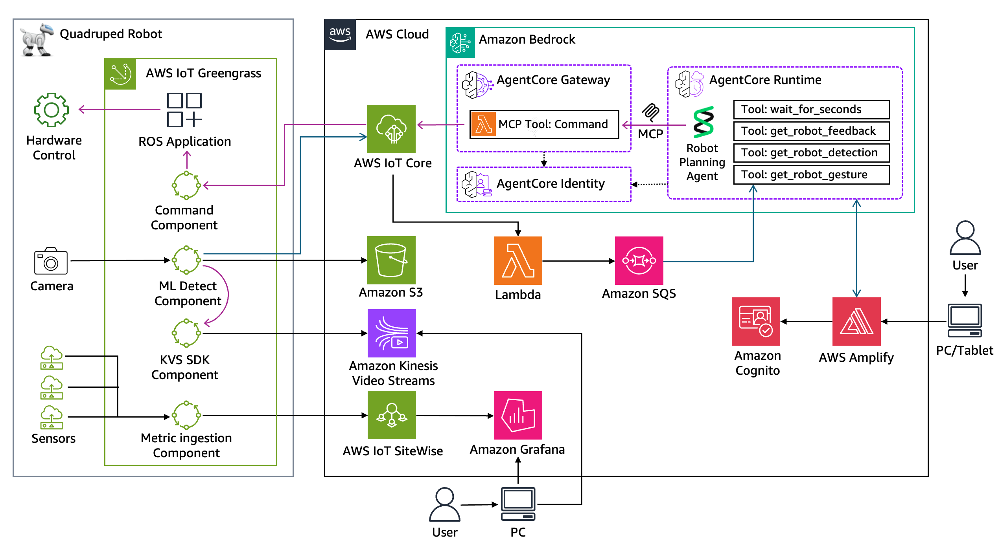

<div align="center">
  
  
  <h1>
      Agentic AI Robot: 산업 안전 모니터링 및 제어
  </h1>

  <p>
    <a href="./README.md">English</a>
    ◆ <a href="./README-ko.md">한국어</a>
  </p>
</div>

이 프로젝트는 **Agentic AI**, **IoT**, **Robotics**의 융합을 보여주는 **Physical AI** 시스템 구축을 위한 참조 아키텍처를 제공합니다. Agentic AI 추론, 로봇 자율성, IoT 센싱을 결합하여 산업 환경에서 자율 의사결정과 실세계 행동이 가능한 시스템을 만드는 방식으로 Physical AI가 디지털 지능과 물리적 행동 사이의 간극을 메우는 방법을 보여줍니다.

## 개요

이 데모는 Amazon Bedrock AgentCore, AWS IoT services, Robotics를 결합한 차세대 산업 안전 관리 솔루션을 보여줍니다. 지능형 로봇 시스템이 위험 지역을 자율적으로 순찰하며 데이터를 수집하고 edge inference를 수행하는 동시에, AI agent가 이 정보를 종합적으로 분석하여 순찰 경로와 대응을 실시간으로 제어합니다. 이를 통해 인간의 접근이 어렵거나 위험한 산업 환경에서 사고 예방률과 대응 속도가 크게 향상됩니다.

> [!IMPORTANT]
> 이 저장소에서 제공하는 예제는 실험 및 교육 목적으로만 제공됩니다. 개념과 기법을 보여주지만 프로덕션 환경에서 직접 사용하기 위한 것은 아닙니다.

<div align="center">
  
</div>

| 클라이언트 앱 | 대시보드 |
|:---:|:---:|
| [](./assets/client-app.png) | [](./assets/dashboard.png) |

## 🎥 데모 비디오

| 데모 비디오 1 | 데모 비디오 2 |
|:---:|:---:|
| [](https://www.youtube.com/shorts/plwrFz4fmFg) | [](https://www.youtube.com/shorts/qiS9_LSYsV8) |

*이 프로젝트는 AWS AI x Industry Week 2025에서 데모로 시연되었습니다.*

---

## 🏗️ 아키텍처 개요

자율 산업 모니터링을 위해 **Physical AI**, **Agentic AI**, **IoT**, **Robotics**를 통합한 **클라우드 네이티브, 이벤트 기반 시스템**.



## 🔍 핵심 구성 요소

## 🧠 Agentic AI for Autonomous Robotics

- **LLM 기반 자율성**: 사전 프로그래밍된 로직을 넘어선 지능적 의사결정 지원
- **Bedrock AgentCore 배포**: AI Agent와 MCP 서버가 통합 환경에서 작동하며 Agentic AI 패턴을 따름
- **동적 계획**: 센서 데이터, 비디오 분석, 사용자 요청을 통합하여 복잡한 상황을 해석하고 순찰 경로를 계획
- **컨텍스트 인식 의사결정**: 예측 불가능한 상황에 대한 지능적 대응을 위한 운영 컨텍스트 유지

## 🗣️ Natural Language Command Interface

- **대화형 제어**: 직관적인 로봇 제어 가능 (예: "저장 구역을 순찰해") 
- **지능적 쿼리**: 의도 인식을 수행하고 사용자 요청을 구조화된 명령으로 변환
- **MCP 프로토콜**: AI Agent와 로봇 하드웨어 간의 표준화되고 확장 가능한 인터페이스로 자연어가 정확한 로봇 행동에 직접 매핑되도록 보장

## 🤖 Physical AI: IoT-Enabled Robotics

- **자율 구현**: 로봇이 실세계 행동을 위한 AI 에이전트의 물리적 구현체로 작동
- **실세계 작업 실행**: 자율 순찰 및 위험 감지 (화재, 안전하지 않은 제스처, 가스 누출 등)
- **에지-클라우드 하이브리드 아키텍처**: 분산 추론으로 응답 시간과 계산 효율성 최적화

## 📡 IoT & Edge Intelligence

- **보안 디바이스 통신**: **AWS IoT Core**가 로봇 플릿과 클라우드 간의 양방향 데이터 흐름 관리
- **분산 처리**: AWS IoT Greengrass가 저지연 에지 추론을 가능하게 하고, 클라우드가 심층 분석 수행
- **실시간 비디오 스트리밍**: **Amazon Kinesis Video Streams**가 클라우드 기반 분석을 위한 라이브 영상 제공


## 📊 Data Integration & Visualization

- **중앙화된 데이터 통합**: **AWS IoT SiteWise**가 로봇 텔레메트리, 센서 메트릭, 시스템 상태를 집계
- **통합 대시보드**: Amazon Managed Grafana가 실시간 운영 가시성 제공
- **원활한 피드백 루프**: 로봇, AI 에이전트, 인간 운영자 간의 지속적인 상호작용

## ⚙️ 주요 AWS 서비스

| **서비스 카테고리** | **AWS 서비스** | **아키텍처 내 역할** |
|---------------------|-----------------|-------------------------|
| **🧠 Agentic AI** | Amazon Bedrock AgentCore | MCP 통합이 있는 에이전트 런타임 환경 |
| | Amazon Bedrock | 추론 및 비전을 위한 기초 모델 |
| | AWS Lambda | MCP 도구 통합 및 로봇 제어 |
| **🤖 Robotics & IoT** | AWS IoT Core | 디바이스 연결 및 메시징 |
| | AWS IoT Greengrass | 에지 컴퓨팅 및 로컬 추론 |
| | Amazon SQS | 이벤트 기반 로봇 피드백 스트리밍 |
| **📊 데이터 & 분석** | AWS IoT SiteWise | 산업 데이터 모델링 및 분석 |
| | Amazon Managed Grafana | 실시간 모니터링 대시보드 |
| | Amazon Kinesis Video Streams | 라이브 비디오 처리 및 분석 |
| **🔐 보안** | Amazon Cognito | 사용자 인증 및 권한 부여 |
| | AWS Secrets Manager | 안전한 자격 증명 관리 |
| **💻 프론트엔드** | AWS Amplify | 풀스택 웹 애플리케이션 호스팅 |

---

## 시작하기

### 사전 요구사항

- Bedrock 액세스가 활성화된 **AWS 계정**
- **Python 3.11+** 및 pip
- **Node.js 18+** 및 npm/yarn
- 적절한 권한으로 구성된 **AWS CLI**
- AI 에이전트 및 IoT 개념에 대한 기본 이해

### 빠른 설정

1. **저장소 클론**
   ```bash
   git clone https://github.com/aws-samples/sample-agentic-ai-robot.git
   cd sample-agentic-ai-robot
   ```

2. **환경 설정**
   ```bash
   # 환경 템플릿 복사
   cp .env.template .env
   
   # AWS 리소스 값으로 편집
   nano .env
   
   # 모든 설정 파일 생성
   python scripts/generate_configs.py
   ```
   
   > 📋 포괄적인 환경 설정 지침 및 설정 파일 관리에 대해서는 [CONFIGURATION.md](CONFIGURATION.md)를 참조하세요.

3. **백엔드 서비스 배포**
   ```bash
   # 백엔드 종속성 설치
   cd agent-runtime
   pip install -r requirements.txt
   
   # AgentCore 런타임 배포
   ./scripts/deploy.sh
   ```

4. **프론트엔드 애플리케이션 설정**
   ```bash
   # 프론트엔드 디렉토리로 이동
   cd ../amplify-frontend
   
   # 종속성 설치
   npm install
   
   # Amplify 백엔드 배포
   npx ampx sandbox
   
   # 개발 서버 시작
   npm start
   ```

5. **IoT 구성 요소 배포**
   ```bash
   # 루트 디렉토리로 이동
   cd ..
   
   # 피드백 매니저 배포
   cd feedback-manager
   python create_feedback_manager.py
   
   # 로봇 컨트롤러 배포
   cd ../robo-controller
   python create_robo_controller.py
   
   # MCP 게이트웨이 배포
   cd ../agent-gateway
   python mcp-interface/create_gateway_tool.py
   ```

6. **엣지 AI 안전 감지 배포**
   ```bash
   # Greengrass 컴포넌트로 이동
   cd ../ggv2-component-safetydetector
   
   # 컴포넌트 빌드 및 게시
   gdk component build
   gdk component publish
   
   # AWS IoT 콘솔을 통해 Greengrass 디바이스에 배포
   ```

### 엣지 AI 안전 감지 설정

**ggv2-component-safetydetector**는 엣지에서 컴퓨터 비전을 사용한 실시간 안전 모니터링을 제공합니다:

**주요 기능:**
- 산업 안전 감지를 위한 ONNX YOLO 모델
- 실시간 카메라 피드 처리
- 감지된 위반 사항의 자동 이미지 캡처 및 S3 업로드
- 즉시 알림을 위한 IoT Core 통합

**설정 매개변수:**
- `BUCKET_NAME`: 감지된 이미지를 위한 S3 버킷
- `IOT_ENDPOINT`: AWS IoT 엔드포인트
- `DETECT_COUNT`: 알림 전 감지 임계값
- `DETECT_INTERVAL`: 감지 빈도 (초)

**배포:**
1. 엣지 디바이스에서 AWS IoT Greengrass Core v2 구성
2. GDK를 사용하여 컴포넌트 빌드 및 게시
3. 설정과 함께 AWS IoT 콘솔을 통해 배포
4. 배포 시 컴포넌트가 자동으로 모니터링 시작

### 프로젝트 구조

| 구성 요소 | 용도 | 기술 |
|-----------|---------|------------|
| **agent-runtime** | AI 에이전트 백엔드 | Amazon Bedrock, Python |
| **agent-gateway** | 로봇 제어를 위한 MCP 서버 | AWS Lambda, MCP |
| **amplify-app** | 웹 인터페이스 | React, AWS Amplify |
| **lambda-iot-managers** | IoT 데이터 처리 | AWS Lambda, AWS IoT Core, SQS |
| **lambda-robo-controller** | 직접 로봇 명령 | AWS Lambda |
| **ggv2-component-safetydetector** | 엣지 AI 안전 감지 | AWS IoT Greengrass, ONNX YOLO |
| **ml-training-safetydetection** | ML 모델 훈련 파이프라인 | YOLOv8, ONNX |
| **polly-tts** | 텍스트 음성 변환 | AWS Polly |

## 기여자

이 프로젝트에 귀중한 기여를 해주신 다음 기여자들에게 감사드립니다:

- **개발** - [Jinseon Lee](https://www.linkedin.com/in/jinseon-lee-160a2a13b), [Yoojung Lee](https://www.linkedin.com/in/yoo-lee), [Kyoungsu Park](https://www.linkedin.com/in/kyoungsu-park-9b9a1068), [YeonKyung Park](https://www.linkedin.com/in/yeon-kyung-park-790b52195), [Sejin Kim](https://www.linkedin.com/in/saygenie)
- **지원** - [Cheolmin Ki](https://www.linkedin.com/in/cheolminki), [Yongjin Lee](https://www.linkedin.com/in/yongjin-lee-1167a710), [Hyewon Lee](https://www.linkedin.com/in/hyewon-l-629b55188), [Areum Lee](https://www.linkedin.com/in/areum-l-752258386)

---

## 보안

자세한 내용은 [CONTRIBUTING](CONTRIBUTING.md#security-issue-notifications)을 참조하세요.

## 라이선스

이 라이브러리는 MIT-0 라이선스로 라이선스됩니다. [LICENSE](LICENSE) 파일을 참조하세요.

