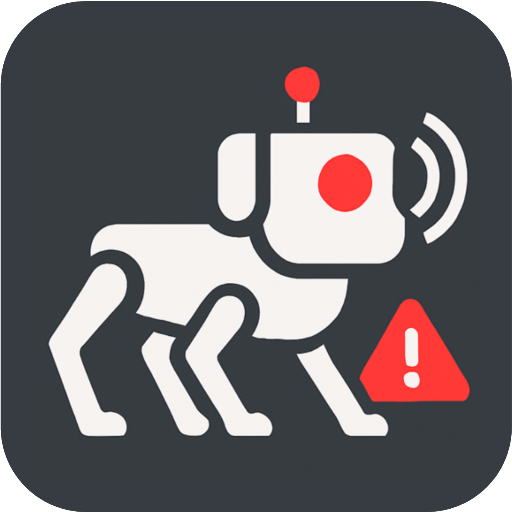
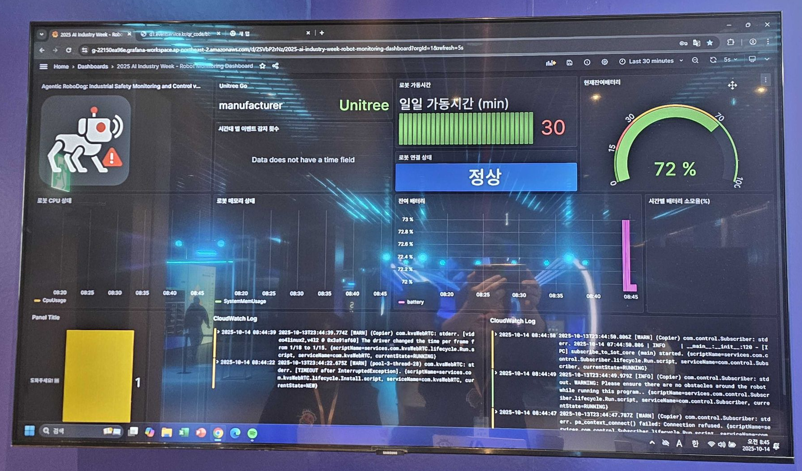
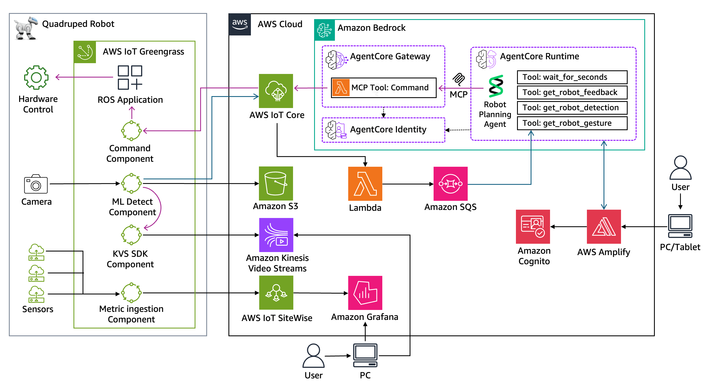

<div align="center">
  
  
  <h1>
      Agentic AI Robot: 산업 안전 모니터링 및 제어
  </h1>

  <p>
    <a href="./README.md">English</a>
    ◆ <a href="./README-ko.md">한국어</a>
  </p>
</div>

이 프로젝트는 **Agentic AI**, **IoT**, **Robotics**의 융합을 보여주는 **Physical AI** 시스템 구축을 위한 참조 아키텍처를 제공합니다. Agentic AI 추론, 로봇 자율성, IoT 센싱을 결합하여 산업 환경에서 자율 의사결정과 실세계 행동이 가능한 시스템을 만드는 방식으로 Physical AI가 디지털 지능과 물리적 행동 사이의 간극을 메우는 방법을 보여줍니다.

## 개요

이 데모는 Amazon Bedrock AgentCore, AWS IoT services, Robotics를 결합한 차세대 산업 안전 관리 솔루션을 보여줍니다. 지능형 로봇 시스템이 위험 지역을 자율적으로 순찰하며 데이터를 수집하고 edge inference를 수행하는 동시에, AI agent가 이 정보를 종합적으로 분석하여 순찰 경로와 대응을 실시간으로 제어합니다. 이를 통해 인간의 접근이 어렵거나 위험한 산업 환경에서 사고 예방률과 대응 속도가 크게 향상됩니다.

> [!IMPORTANT]
> 이 저장소에서 제공하는 예제는 실험 및 교육 목적으로만 제공됩니다. 개념과 기법을 보여주지만 프로덕션 환경에서 직접 사용하기 위한 것은 아닙니다.

<div align="center">
  
</div>

| 클라이언트 앱 | 대시보드 |
|:---:|:---:|
| [](./assets/client-app.png) | [](./assets/dashboard.png) |

## 🎥 데모 비디오

| 데모 비디오 1 | 데모 비디오 2 |
|:---:|:---:|
| [](https://www.youtube.com/shorts/plwrFz4fmFg) | [](https://www.youtube.com/shorts/qiS9_LSYsV8) |

*이 프로젝트는 AWS AI x Industry Week 2025에서 데모로 시연되었습니다.*

---

## 🏗️ 아키텍처 개요

자율 산업 모니터링을 위해 **Physical AI**, **Agentic AI**, **IoT**, **Robotics**를 통합한 **클라우드 네이티브, 이벤트 기반 시스템**.



## 🔍 핵심 구성 요소

### 🧠 Agentic AI for Autonomous Robotics

- 환경 조건의 멀티모달 이해 (텍스트, 비전, 센서 데이터)
- **Strands Agent SDK**를 사용한 **동적 작업 계획** 및 컨텍스트 인식 의사결정
- **Bedrock AgentCore** 환경에 배포된 AI 에이전트 및 MCP 서버
- **MCP 통합 도구**를 통한 자연어에서 로봇 명령으로의 번역

### 🗣️ 자연어 명령 인터페이스
- **의도 인식**: "구역 A 순찰" → 구조화된 로봇 제어 명령
- **컨텍스트 이해**: 대화 이력 및 환경 컨텍스트 유지
- **MCP 서버 통합**: 높은 수준의 지시를 정확한 로봇 행동으로 변환

### 🤖 Physical AI 시스템
- 로봇은 실세계 행동이 가능한 **자율 에이전트**로 작동
- 순찰 수행, 위험 감지 (예: 화재, 비정상적인 인간 제스처, 가스 누출)
- **에지-클라우드 하이브리드 처리**: 분산 추론 아키텍처를 통한 지연시간 최적화

### 📡 IoT 및 에지 인텔리전스
- **AWS IoT Core**를 통한 실시간 센서 및 텔레메트리 데이터 수집
- **AWS IoT Greengrass**를 사용한 저지연 감지를 위한 에지 추론
- 로봇과 클라우드 시스템 간의 보안 통신

### 📹 실시간 비디오 처리 및 분석
- **Amazon Kinesis Video Streams**를 통한 실시간 비디오 데이터 스트리밍
- Greengrass 또는 클라우드의 AI 모델을 통한 비디오 분석
- 위험 상황 감지를 위한 실시간 처리

### 📊 데이터 통합 및 시각화
- **AWS IoT SiteWise**를 통한 로봇 상태, 시스템 상태, IoT 센서 메트릭 통합
- **Amazon Managed Grafana**를 사용한 운영 대시보드

## ⚙️ 주요 AWS 서비스

| **서비스 카테고리** | **AWS 서비스** | **아키텍처 내 역할** |
|---------------------|-----------------|-------------------------|
| **🧠 Agentic AI** | Amazon Bedrock AgentCore | MCP 통합이 있는 에이전트 런타임 환경 |
| | Amazon Bedrock | 추론 및 비전을 위한 기초 모델 |
| | AWS Lambda | MCP 도구 통합 및 로봇 제어 |
| **🤖 Robotics & IoT** | AWS IoT Core | 디바이스 연결 및 메시징 |
| | AWS IoT Greengrass | 에지 컴퓨팅 및 로컬 추론 |
| | Amazon SQS | 이벤트 기반 로봇 피드백 스트리밍 |
| **📊 데이터 & 분석** | AWS IoT SiteWise | 산업 데이터 모델링 및 분석 |
| | Amazon Managed Grafana | 실시간 모니터링 대시보드 |
| | Amazon Kinesis Video Streams | 라이브 비디오 처리 및 분석 |
| **🔐 보안** | Amazon Cognito | 사용자 인증 및 권한 부여 |
| | AWS Secrets Manager | 안전한 자격 증명 관리 |
| **💻 프론트엔드** | AWS Amplify | 풀스택 웹 애플리케이션 호스팅 |

---

## 시작하기

### 사전 요구사항

- Bedrock 액세스가 활성화된 **AWS 계정**
- **Python 3.9+** 및 pip
- **Node.js 18+** 및 npm/yarn
- 적절한 권한으로 구성된 **AWS CLI**
- AI 에이전트 및 IoT 개념에 대한 기본 이해

### 빠른 설정

1. **저장소 클론**
   ```bash
   git clone https://github.com/aws-samples/sample-agentic-ai-robot.git
   cd sample-agentic-ai-robot
   ```

2. **환경 설정**
   ```bash
   # 환경 템플릿 복사
   cp .env.template .env
   
   # AWS 리소스 값으로 편집
   nano .env
   
   # 모든 설정 파일 생성
   python scripts/generate_configs.py
   ```
   
   > 📋 포괄적인 환경 설정 지침 및 설정 파일 관리에 대해서는 [CONFIGURATION.md](CONFIGURATION.md)를 참조하세요.

3. **백엔드 서비스 배포**
   ```bash
   # 백엔드 종속성 설치
   cd agent-runtime
   pip install -r requirements.txt
   
   # AgentCore 런타임 배포
   ./scripts/deploy.sh
   ```

4. **프론트엔드 애플리케이션 설정**
   ```bash
   # 프론트엔드 디렉토리로 이동
   cd ../amplify-frontend
   
   # 종속성 설치
   npm install
   
   # Amplify 백엔드 배포
   npx ampx sandbox
   
   # 개발 서버 시작
   npm start
   ```

5. **IoT 구성 요소 배포**
   ```bash
   # 루트 디렉토리로 이동
   cd ..
   
   # 피드백 매니저 배포
   cd feedback-manager
   python create_feedback_manager.py
   
   # 로봇 컨트롤러 배포
   cd ../robo-controller
   python create_robo_controller.py
   
   # MCP 게이트웨이 배포
   cd ../agent-gateway
   python mcp-interface/create_gateway_tool.py
   ```

### 프로젝트 구조

| 구성 요소 | 용도 | 기술 |
|-----------|---------|------------|
| **agent-runtime** | AI 에이전트 백엔드 | Amazon Bedrock, Python |
| **agent-gateway** | 로봇 제어를 위한 MCP 서버 | AWS Lambda, MCP |
| **amplify-app** | 웹 인터페이스 | React, AWS Amplify |
| **lambda-iot-managers** | IoT 데이터 처리 | AWS Lambda, AWS IoT Core, SQS |
| **lambda-robo-controller** | 직접 로봇 명령 | AWS Lambda |
| **polly-tts** | 텍스트 음성 변환 | AWS Polly |

## 기여자

이 프로젝트에 귀중한 기여를 해주신 다음 기여자들에게 감사드립니다:

- **개발** - [Jinseon Lee](https://www.linkedin.com/in/jinseon-lee-160a2a13b), [Yoojung Lee](https://www.linkedin.com/in/yoo-lee), [Kyoungsu Park](https://www.linkedin.com/in/kyoungsu-park-9b9a1068), [YeonKyung Park](https://www.linkedin.com/in/yeon-kyung-park-790b52195), [Sejin Kim](https://www.linkedin.com/in/saygenie)
- **지원** - [Cheolmin Ki](https://www.linkedin.com/in/cheolminki), [Yongjin Lee](https://www.linkedin.com/in/yongjin-lee-1167a710), [Hyewon Lee](https://www.linkedin.com/in/hyewon-l-629b55188), [Areum Lee](https://www.linkedin.com/in/areum-l-752258386)

---

## 보안

자세한 내용은 [CONTRIBUTING](CONTRIBUTING.md#security-issue-notifications)을 참조하세요.

## 라이선스

이 라이브러리는 MIT-0 라이선스로 라이선스됩니다. [LICENSE](LICENSE) 파일을 참조하세요.

