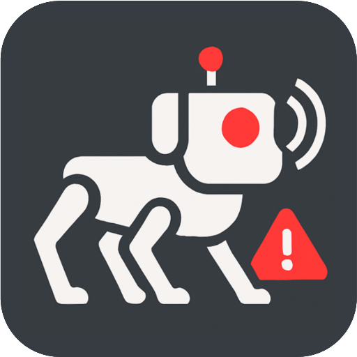
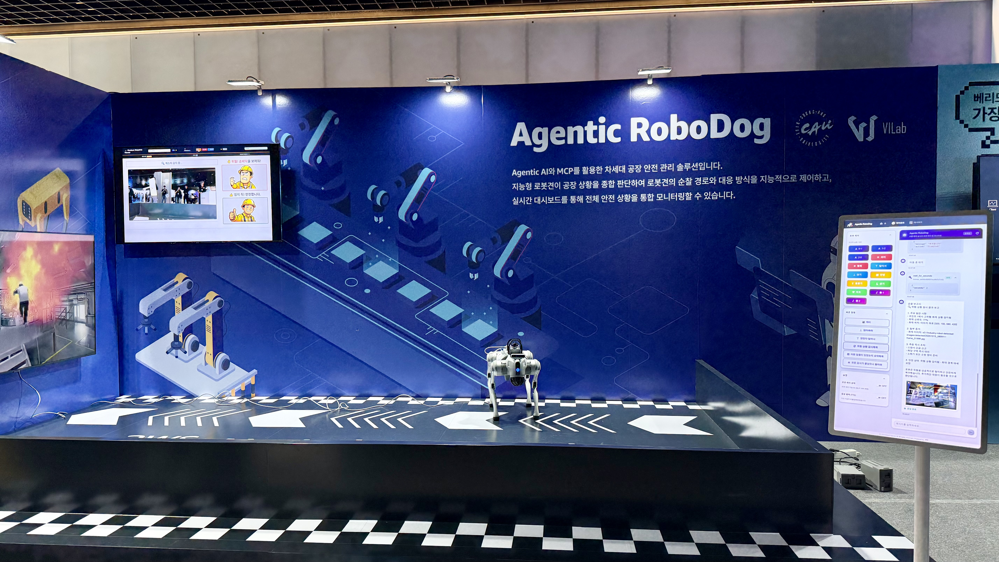
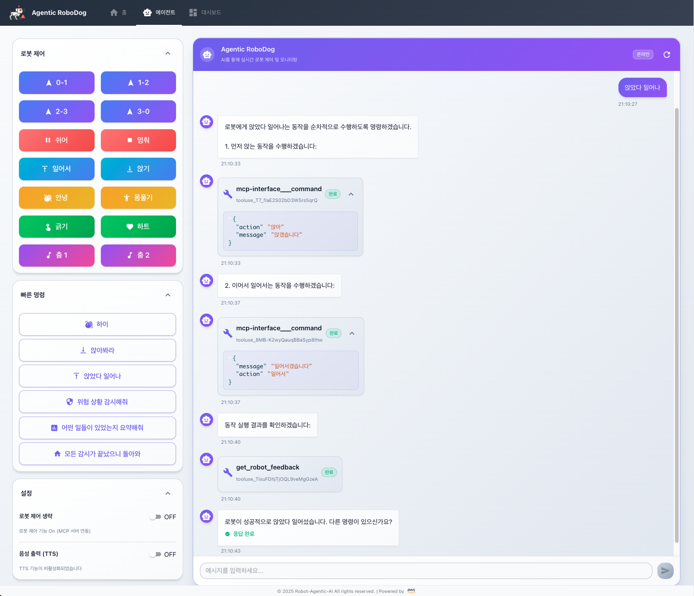
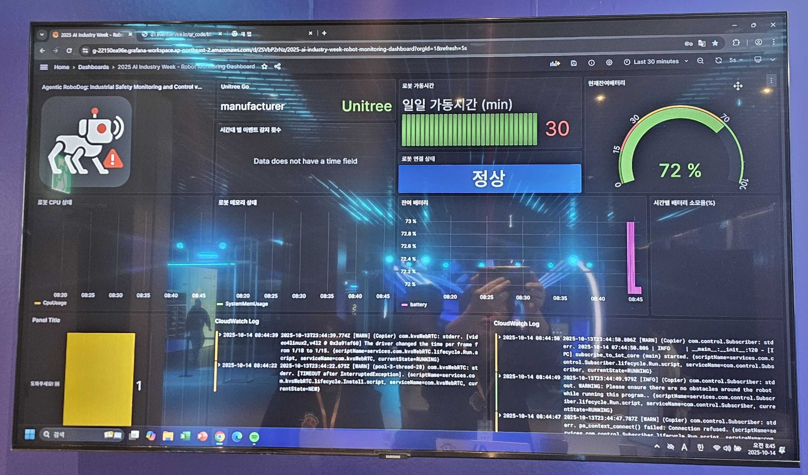
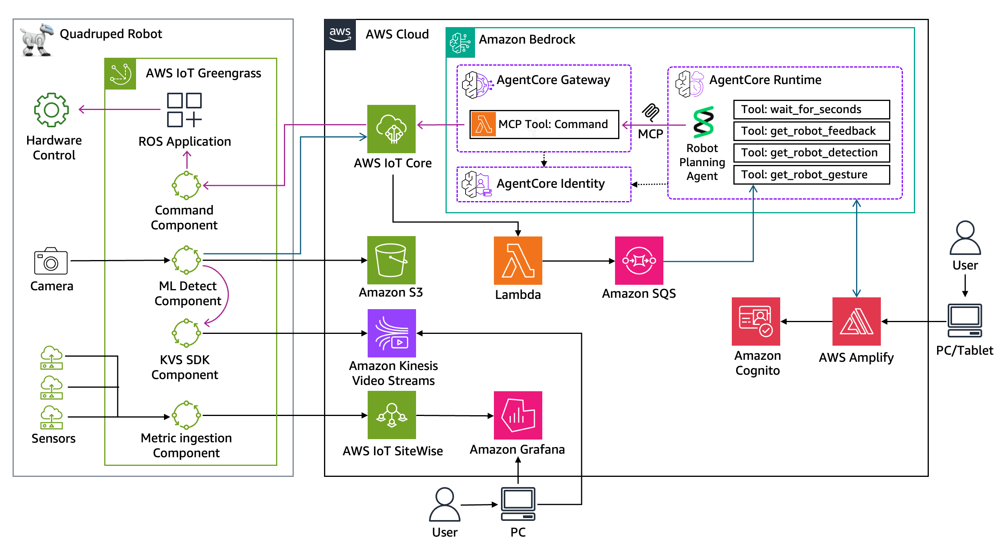

<div align="center">
  
  
  <h1>
      Agentic AI Robot: Industrial Safety Monitoring and Control
  </h1>

  <p>
    <a href="./README.md">English</a>
    ◆ <a href="./README-ko.md">한국어</a>
  </p>
</div>

This project provides a reference architecture for building a **Physical AI** system that demonstrates the convergence of **Agentic AI**, **IoT**, and **Robotics**. It showcases how Physical AI bridges the gap between digital intelligence and physical action by combining Agentic AI reasoning, Robotic autonomy, and IoT sensing to create systems capable of autonomous decision-making and real-world action in industrial environments.

## Overview

This demo showcases a next-generation industrial safety management solution that combines Amazon Bedrock AgentCore, AWS IoT services, and Robotics. An intelligent robotic system autonomously patrols hazardous areas, collecting data and performing edge inference, while an AI agent comprehensively analyzes this information to control patrol routes and responses in real-time. This enables dramatically improved accident prevention rates and response speeds in industrial environments where human access is difficult or dangerous.

> [!IMPORTANT]
> The examples provided in this repository are for experimental and educational purposes only. They demonstrate concepts and techniques but are not intended for direct use in production environments.

<div align="center">
  
</div>

| Client App | Dashboard |
|:---:|:---:|
| [](./assets/client-app.png) | [](./assets/dashboard.png) |

## 🎥 Demo Video

| Demo Video 1 | Demo Video 2 |
|:---:|:---:|
| [](https://www.youtube.com/shorts/plwrFz4fmFg) | [](https://www.youtube.com/shorts/qiS9_LSYsV8) |

*This project was showcased at AWS AI x Industry Week 2025*

---

## 🏗️ Architecture Overview

A **cloud-native, event-driven system** that integrates **Physical AI**, **Agentic AI**, **IoT** and **Robotics** for autonomous industrial monitoring.



## 🔍 Core Components

## 🧠 Agentic AI for Autonomous Robotics

- **LLM-driven Autonomy**: Powers intelligent decision-making beyond pre-programmed logic
- **Bedrock AgentCore Deployment**: AI Agent and MCP server operate in unified environment, following an Agentic AI pattern
- **Dynamic Planning**: Interprets complex situations and plans patrol routes by integrating sensor data, video analysis, and user requests
- **Context-aware Decision**: Maintains operational context for intelligent response to unpredictable situations

## 🗣️ Natural Language Command Interface

- **Conversational Control**: Enables intuitive robot control (e.g., "Patrol the storage area")
- **Intelligent Query**: Performs intent recognition and converts user requests into structured commands
- **MCP Protocol**: Standardized, extensible interface between AI Agent and robot hardware, ensuring natural language maps directly to precise robotic actions

## 🤖 Physical AI: IoT-Enabled Robotics

- **Autonomous Embodiment**: Robot acts as physical embodiment of AI agent for real-world action
- **Real-world Task Execution**: Autonomous patrolling and hazard detection (fire, unsafe gestures, gas leaks, etc.)
- **Edge-Cloud Hybrid Architecture**: Distributed inference optimizes response time and computational efficiency

## 📡 IoT & Edge Intelligence

- **Secure Device Communication**: **AWS IoT Core** manages bidirectional data flow between robot fleet and cloud
- **Distributed Processing**: AWS IoT Greengrass enables low-latency edge inference; cloud performs deep analysis
- **Real-time Video Streaming**: **Amazon Kinesis Video Streams** delivers live footage for cloud-based analysis

## 📊 Data Integration & Visualization

- **Centralized Data Integration**: **AWS IoT SiteWise** aggregates robot telemetry, sensor metrics, and system status
- **Unified Dashboard**: Amazon Managed Grafana provides real-time operational visibility
- **Seamless Feedback Loop**: Continuous interaction between robot, AI agent, and human operators

## ⚙️ Key AWS Services

| **Service Category** | **AWS Service** | **Role in Architecture** |
|---------------------|-----------------|-------------------------|
| **🧠 Agentic AI** | Amazon Bedrock AgentCore | Agent runtime environment with MCP integration |
| | Amazon Bedrock | Foundation models for reasoning and vision |
| | AWS Lambda | MCP tool integration and robot control |
| **🤖 Robotics & IoT** | AWS IoT Core | Device connectivity and messaging |
| | AWS IoT Greengrass | Edge computing and local inference |
| | Amazon SQS | Event-driven robot feedback streaming |
| **📊 Data & Analytics** | AWS IoT SiteWise | Industrial data modeling and analytics |
| | Amazon Managed Grafana | Real-time monitoring dashboards |
| | Amazon Kinesis Video Streams | Live video processing and analysis |
| **🔐 Security** | Amazon Cognito | User authentication and authorization |
| | AWS Secrets Manager | Secure credential management |
| **💻 Frontend** | AWS Amplify | Full-stack web application hosting |

---

## Getting Started

### Prerequisites

- **AWS Account** with Bedrock access enabled
- **Python 3.11+** and pip
- **Node.js 18+** and npm/yarn
- **AWS CLI** configured with appropriate permissions
- Basic understanding of AI agents and IoT concepts

### Quick Setup

1. **Clone the repository**
   ```bash
   git clone https://github.com/aws-samples/sample-agentic-ai-robot.git
   cd sample-agentic-ai-robot
   ```

2. **Environment Configuration**
   ```bash
   # Copy environment template
   cp .env.template .env
   
   # Edit with your AWS resource values
   nano .env
   
   # Generate all configuration files
   python scripts/generate_configs.py
   ```
   
   > 📋 See [CONFIGURATION.md](CONFIGURATION.md) for comprehensive environment setup instructions and configuration file management.

3. **Deploy Backend Services**
   ```bash
   # Install backend dependencies
   cd agent-runtime
   pip install -r requirements.txt
   
   # Deploy AgentCore runtime
   ./scripts/deploy.sh
   ```

4. **Setup Frontend Application**
   ```bash
   # Navigate to frontend directory
   cd ../amplify-frontend
   
   # Install dependencies
   npm install
   
   # Deploy Amplify backend
   npx ampx sandbox
   
   # Start development server
   npm start
   ```

5. **Deploy IoT Components**
   ```bash
   # Return to root directory
   cd ..
   
   # Deploy feedback manager
   cd feedback-manager
   python create_feedback_manager.py
   
   # Deploy robot controller
   cd ../robo-controller
   python create_robo_controller.py
   
   # Deploy MCP gateway
   cd ../agent-gateway
   python mcp-interface/create_gateway_tool.py
   ```

### Project Structure

| Component | Purpose | Technology |
|-----------|---------|------------|
| **agent-runtime** | AI agent backend | Amazon Bedrock, Python |
| **agent-gateway** | MCP server for robot control | AWS Lambda, MCP |
| **amplify-app** | Web interface | React, AWS Amplify |
| **lambda-iot-managers** | IoT data processing | AWS Lambda, AWS IoT Core, SQS |
| **lambda-robo-controller** | Direct robot commands | AWS Lambda |
| **polly-tts** | Text-to-speech | AWS Polly |

## Contributors

We would like to thank the following contributors for their valuable contributions to this project:

- **Development** - [Jinseon Lee](https://www.linkedin.com/in/jinseon-lee-160a2a13b), [Yoojung Lee](https://www.linkedin.com/in/yoo-lee), [Kyoungsu Park](https://www.linkedin.com/in/kyoungsu-park-9b9a1068), [YeonKyung Park](https://www.linkedin.com/in/yeon-kyung-park-790b52195), [Sejin Kim](https://www.linkedin.com/in/saygenie)
- **Support** - [Cheolmin Ki](https://www.linkedin.com/in/cheolminki), [Yongjin Lee](https://www.linkedin.com/in/yongjin-lee-1167a710), [Hyewon Lee](https://www.linkedin.com/in/hyewon-l-629b55188), [Areum Lee](https://www.linkedin.com/in/areum-l-752258386)

---

## Security

See [CONTRIBUTING](CONTRIBUTING.md#security-issue-notifications) for more information.

## License

This library is licensed under the MIT-0 License. See the [LICENSE](LICENSE) file.
