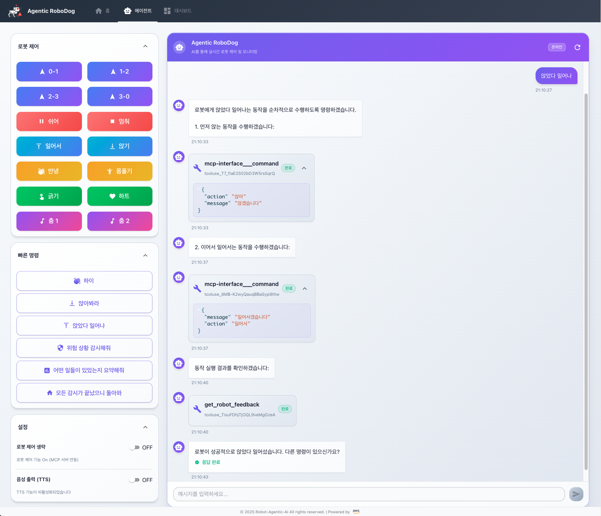

# 🎮 Agentic RoboDog - 웹 인터페이스

> **AI 기반 로봇 제어 및 모니터링 웹 애플리케이션**

React 18, TypeScript, AWS Amplify를 사용하여 구축된 현대적인 로봇 제어 인터페이스입니다. AWS Bedrock AgentCore를 통한 AI 대화와 실시간 로봇 제어 기능을 제공하며, 사용자가 직접 자연어로 로봇과 상호작용할 수 있는 몰입감 있는 경험을 제공합니다.

<div align="center">
  
</div>

## 🚀 주요 기능

### 🤖 AI 로봇 제어
- **실시간 AI 대화**: AWS Bedrock AgentCore를 통한 자연어 처리
- **로봇 제어 버튼**: 직관적인 버튼 인터페이스로 로봇 동작 제어
- **빠른 명령**: 자주 사용하는 명령을 빠르게 실행
- **스트리밍 응답**: 실시간으로 AI 응답을 받아볼 수 있음
- **자연어 명령**: "위험 구역을 순찰해 줘", "화재가 발생한 곳의 영상을 보여줘" 등 자연어 명령 지원

### 🎵 음성 기능
- **TTS (Text-to-Speech)**: AWS Polly를 사용한 한국어 음성 출력
- **음성 제어**: 재생, 일시정지, 정지 기능
- **자동 재생**: AI 응답 완료 시 자동 음성 출력
- **다양한 음성**: Seoyeon, Jihye 등 한국어 음성 지원

### 🎨 현대적인 UI/UX
- **반응형 디자인**: 모든 디바이스에서 최적화된 경험
- **Material-UI**: 세련된 컴포넌트와 애니메이션
- **실시간 상태 표시**: 연결 상태, 로봇 제어 상태 등
- **접을 수 있는 패널**: 공간 효율적인 인터페이스
- **다크/라이트 테마**: 사용자 선호에 따른 테마 변경

### 🔐 보안 및 인증
- **AWS Cognito**: 안전한 사용자 인증
- **IAM 권한 관리**: 필요한 AWS 서비스에만 접근
- **환경 변수 보안**: 민감한 정보 보호
- **JWT 토큰 관리**: 자동 토큰 갱신 및 보안

### 📊 실시간 모니터링
- **로봇 상태 모니터링**: 현재 위치, 상태, 센서 데이터 실시간 표시
- **IoT 센서 데이터**: 온도, 가스 등 센서 정보 시각화
- **영상 스트리밍**: Kinesis Video Streams를 통한 실시간 영상
- **위험 상황 알림**: 위험 감지 시 즉시 알림 및 시각적 강조

## 🛠 기술 스택

### Frontend
- **React 18.3.1** - UI 라이브러리
- **TypeScript 4.9.5** - 타입 안전성
- **Create React App** - 개발 환경 및 빌드 도구
- **Material-UI 7.3.2** - UI 컴포넌트 라이브러리
- **React Router 6.28.0** - 클라이언트 사이드 라우팅

### Backend & AI
- **AWS Amplify 6.15.5** - 백엔드 서비스
- **AWS Bedrock AgentCore** - AI 대화 엔진
- **AWS Polly** - 텍스트-음성 변환
- **AWS Lambda** - 로봇 제어 함수
- **AWS Cognito** - 사용자 인증

### 개발 도구
- **ESLint** - 코드 품질 관리
- **Testing Library** - 컴포넌트 테스트
- **Craco** - Create React App 설정 오버라이드

## 📁 프로젝트 구조

```
amplify-frontend/
├── src/
│   ├── components/              # 재사용 가능한 컴포넌트
│   │   ├── ChatInterface.tsx   # 채팅 인터페이스
│   │   ├── Layout.tsx          # 메인 레이아웃
│   │   └── StreamingMessage.tsx # 스트리밍 메시지 컴포넌트
│   ├── pages/                  # 페이지 컴포넌트
│   │   ├── Agent.tsx           # AI 에이전트 페이지 (메인)
│   │   ├── Dashboard.tsx       # 대시보드 페이지
│   │   └── Home.tsx            # 홈 페이지
│   ├── lib/                    # 유틸리티 및 설정
│   │   ├── BedrockAgentCore.ts # AI 에이전트 통신
│   │   ├── PollyTTS.ts         # 음성 합성 서비스
│   │   ├── LambdaClient.ts     # Lambda 함수 클라이언트
│   │   ├── amplify.ts          # Amplify 설정
│   │   └── aws-credentials.ts  # AWS 자격 증명
│   ├── config/                 # 설정 파일
│   │   ├── robotControlButton.json # 로봇 제어 버튼 설정
│   │   └── quickCommandButton.json # 빠른 명령 설정
│   ├── hooks/                  # 커스텀 훅
│   │   └── useStreamingMessages.ts # 메시지 상태 관리
│   └── App.tsx                 # 메인 앱 컴포넌트
├── amplify/                    # Amplify 백엔드 설정
│   ├── backend.ts              # 백엔드 정의
│   ├── auth/resource.ts        # 인증 설정
│   └── data/resource.ts        # 데이터 설정
├── public/                     # 정적 파일
├── package.json                # 의존성 관리
├── craco.config.js             # CRA 설정 오버라이드
└── README.md                   # 프로젝트 문서
```

## 🚀 시작하기

### 1. 사전 요구사항

- Node.js 18+ 
- npm 또는 yarn
- AWS 계정 및 적절한 권한
- AWS CLI 설정 (선택사항)

### 2. 환경 변수 설정

프론트엔드는 `src/env.json` 파일을 통해 환경 변수를 관리합니다:

```json
{
  "REACT_APP_AWS_REGION": "us-west-2",
  "REACT_APP_AGENT_RUNTIME_ARN": "arn:aws:bedrock-agentcore:us-west-2:YOUR_AWS_ACCOUNT_ID:runtime/YOUR_RUNTIME_NAME",
  "REACT_APP_QUALIFIER": "DEFAULT"
}
```

**주요 환경 변수:**
- `REACT_APP_AWS_REGION`: AWS 리전 (기본값: us-west-2)
- `REACT_APP_AGENT_RUNTIME_ARN`: Bedrock AgentCore 런타임 ARN
- `REACT_APP_QUALIFIER`: 런타임 퀄리파이어 (기본값: DEFAULT)

**참고**: `amplify_outputs.json`은 Amplify CLI에 의해 자동 생성되며 수동으로 편집하지 마세요.

### 3. 의존성 설치

```bash
npm install
# 또는
yarn install
```

### 4. Amplify 백엔드 배포

```bash
# Amplify 백엔드 배포
npx ampx sandbox

# 또는 프로덕션 배포
npx ampx deploy
```

### 5. 개발 서버 실행

```bash
npm start
# 또는
yarn start
```

개발 서버가 http://localhost:3000에서 실행됩니다.

## 🎮 사용자 경험

### 1. 자율 순찰 관찰
- 지능형 로봇견이 지정된 공장 환경을 자율적으로 순찰하는 모습을 실시간으로 관찰
- 로봇에 장착된 카메라를 통해 화재 발생, 작업자의 위험한 제스처, 설비 이상 등 다양한 위험 상황 즉각 감지
- 실시간 대시보드에 위험 정보가 표시되는 것을 확인

### 2. 자연어 명령 체험
- 사용자가 음성 또는 텍스트를 통해 자연어 명령을 내릴 수 있음
- "위험 구역을 순찰해 줘", "화재가 발생한 곳의 영상을 보여줘" 등 자연어 명령 지원
- AI 에이전트와 MCP 서버가 명령을 이해하고 로봇이 즉시 해당 임무를 수행하는 과정을 직접 확인

### 3. 통합 모니터링
- Amazon Managed Grafana 대시보드를 통한 통합 모니터링
- 로봇의 현재 위치, 상태, 센서 데이터(온도, 가스 등) 실시간 표시
- Kinesis Video Streams를 통한 실시간 영상 스트림
- 위험 상황 발생 시 경고 알림과 함께 관련 데이터 시각적 강조

## 🎮 사용 방법

### 1. 로그인
- AWS Cognito를 통한 안전한 로그인
- 이메일/비밀번호 또는 소셜 로그인 지원
- 자동 토큰 갱신으로 끊김 없는 사용자 경험

### 2. AI 대화
- 텍스트 입력창에 메시지 입력
- Enter 키 또는 전송 버튼으로 메시지 전송
- 실시간으로 AI 응답을 받아볼 수 있음
- 스트리밍 응답으로 즉각적인 피드백 제공

### 3. 로봇 제어
- 왼쪽 패널의 로봇 제어 버튼 사용
- 이동, 동작, 제스처 등 다양한 명령 실행
- 각 버튼은 직관적인 아이콘과 설명 제공
- 빠른 명령 버튼으로 자주 사용하는 명령 즉시 실행

### 4. 음성 기능
- 설정에서 TTS 기능 활성화
- AI 응답의 자동 음성 출력
- 재생, 일시정지, 정지 제어 가능
- 다양한 한국어 음성 선택 가능

### 5. 실시간 모니터링
- 로봇 상태 대시보드에서 실시간 정보 확인
- IoT 센서 데이터 시각화
- 영상 스트림을 통한 로봇 시야 확인
- 위험 상황 발생 시 즉시 알림

## 🔧 개발 가이드

### 컴포넌트 작성

새로운 컴포넌트를 작성할 때는 TypeScript와 Material-UI를 사용하세요:

```tsx
import React from 'react'
import { Box, Typography, Button } from '@mui/material'
import { styled } from '@mui/material/styles'

const StyledButton = styled(Button)(({ theme }) => ({
  borderRadius: 12,
  textTransform: 'none',
  fontWeight: 600,
  // ... 추가 스타일
}))

interface MyComponentProps {
  title: string
  onAction: () => void
}

export function MyComponent({ title, onAction }: MyComponentProps) {
  return (
    <Box>
      <Typography variant="h6">{title}</Typography>
      <StyledButton onClick={onAction}>
        실행
      </StyledButton>
    </Box>
  )
}
```

### API 통신

AWS 서비스와의 통신은 전용 클라이언트를 사용하세요:

```tsx
import { invokeAgentCore } from '../lib/BedrockAgentCore'
import { ttsService } from '../lib/PollyTTS'

// AI 에이전트 호출
const stream = await invokeAgentCore(prompt, sessionId, debugMode)

// TTS 재생
await ttsService.speak(text, { speechRate: 120 })
```

### 상태 관리

커스텀 훅을 사용하여 상태를 관리하세요:

```tsx
import { useStreamingMessages } from '../hooks/useStreamingMessages'

function MyComponent() {
  const { messages, addMessage, updateMessage } = useStreamingMessages()
  
  // 메시지 추가
  const messageId = addMessage({
    type: 'chunk',
    data: 'Hello World',
    isUser: false,
  })
}
```

## 🚀 배포

### 개발 환경

```bash
npm run build
npm run start
```

### 프로덕션 배포

```bash
# Amplify 백엔드 배포
npx ampx deploy

# 프론트엔드 빌드
npm run build

# S3에 배포 (Amplify 호스팅 사용 시 자동)
```

## 🎭 사용 시나리오

### 시나리오 1: 자율 순찰 및 위험 감지
1. **로봇 자율 순찰 시작**: 로봇이 지정된 경로를 따라 자율적으로 순찰
2. **위험 상황 감지**: 화재, 가스 누출, 작업자 안전 위험 등 감지
3. **실시간 알림**: 대시보드에 위험 상황 즉시 표시
4. **AI 분석**: AI가 상황을 분석하고 대응 방안 제시

### 시나리오 2: 자연어 명령 체험
1. **사용자 참여**: 사용자가 자연어로 명령 입력
2. **AI 명령 해석**: "위험 구역을 순찰해 줘" → 로봇 제어 명령 변환
3. **로봇 실행**: 로봇이 즉시 해당 임무 수행
4. **결과 피드백**: 실행 결과를 실시간으로 확인

### 시나리오 3: 비상 상황 대응
1. **비상 상황 발생**: 화재, 가스 누출 등 비상 상황 감지
2. **자동 대응**: AI가 상황을 분석하고 최적의 대응 방안 수립
3. **로봇 제어**: 비상 정지, 대피 경로 안내, 구조 요청 등
4. **상황 보고**: 관리자에게 상세한 상황 보고서 제공

## 🧪 테스트

### 단위 테스트
```bash
# 테스트 실행
npm test

# 테스트 커버리지
npm run test:coverage
```

### 통합 테스트
```bash
# 전체 시스템 테스트
npm run test:integration

# E2E 테스트
npm run test:e2e
```

### 성능 테스트
```bash
# 로드 테스트
npm run test:load

# 메모리 사용량 테스트
npm run test:memory
```
